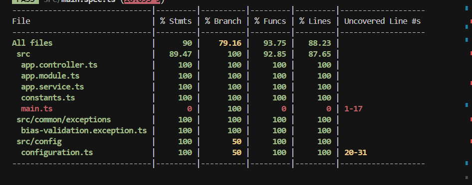
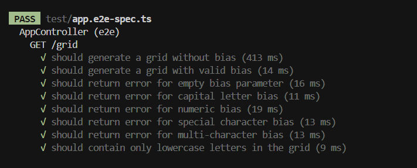

<p align="center">
  <a href="http://nestjs.com/" target="blank"></a>
</p>

[circleci-image]: https://img.shields.io/circleci/build/github/nestjs/nest/master?token=abc123def456
[circleci-url]: https://circleci.com/gh/nestjs/nest

  <p align="center">A progressive <a href="http://nodejs.org" target="_blank">Node.js</a> framework for building efficient and scalable server-side applications.</p>
    <p align="center">
<a href="https://www.npmjs.com/~nestjscore" target="_blank"></a>
<a href="https://www.npmjs.com/~nestjscore" target="_blank"></a>
<a href="https://www.npmjs.com/~nestjscore" target="_blank"></a>
<a href="https://circleci.com/gh/nestjs/nest" target="_blank"></a>
<a href="https://coveralls.io/github/nestjs/nest?branch=master" target="_blank"></a>
<a href="https://discord.gg/G7Qnnhy" target="_blank"></a>
<a href="https://opencollective.com/nest#backer" target="_blank"></a>
<a href="https://opencollective.com/nest#sponsor" target="_blank"></a>
  <a href="https://paypal.me/kamilmysliwiec" target="_blank"></a>
    <a href="https://opencollective.com/nest#sponsor"  target="_blank"></a>
  <a href="https://twitter.com/nestframework" target="_blank"></a>
</p>
  <!--[](https://opencollective.com/nest#backer)
  [](https://opencollective.com/nest#sponsor)-->

# Grid Generator API

A NestJS-based API that generates random alphabet grids with optional character bias.

## Features

- Generates 10x10 grids filled with random lowercase letters
- Supports character bias to increase the frequency of a specific letter
- Generates a unique grid code based on character counts and current time
- Validates bias input for:
  - Empty strings
  - Capital letters
  - Numbers
  - Special characters
  - Multi-character strings
- Returns detailed metadata including:
  - Grid dimensions
  - Bias character and percentage (if applied)
  - Timestamp
  - Version

## API Endpoints

### GET /grid

Generates a random alphabet grid.

**Query Parameters:**

- `bias` (optional): A single lowercase letter to bias the grid generation
  - Must be a single lowercase letter (a-z)
  - Cannot be empty, a number, or a special character
  - Example: `x`

**Example Requests:**

```bash
# Generate random grid
GET http://localhost:3000/grid

# Generate grid with bias
GET http://localhost:3000/grid?bias=x
```

**Example Response:**

```json
{
  "status": {
    "code": 200,
    "message": "Grid generated successfully",
    "success": true
  },
  "data": {
    "gridContents": [...],
    "gridCode": 42,
    "metadata": {
      "dimensions": {
        "rows": 10,
        "columns": 10
      },
      "biasCharacter": "x",
      "biasPercentage": 20,
      "timestamp": "2024-03-21T12:34:56.789Z",
      "version": "1.0.0"
    }
  }
}
```

## API Documentation

The API documentation is available through Swagger UI at `/api` endpoint when the server is running:

```bash
http://localhost:3000/api
```

The Swagger documentation includes:

- Detailed endpoint descriptions
- Request/response schemas
- Example requests and responses
- Validation rules
- Error responses

## Data Validation

The API uses DTOs (Data Transfer Objects) for input validation:

1. Request Validation:

   - Validates query parameters
   - Ensures bias is a single lowercase letter
   - Automatically transforms input data

2. Response Validation:
   - Ensures consistent response structure
   - Validates all required fields
   - Provides type safety

## Project Setup

```bash
# Install dependencies
$ npm install

# Start development server
$ npm run start:dev

# Build for production
$ npm run build

# Start production server
$ npm run start:prod
```

## Testing

```bash
# Run unit tests
$ npm run test

# Run e2e tests
$ npm run test:e2e

# Generate test coverage
$ npm run test:cov
```

### Code Coverage

The project maintains comprehensive test coverage. After running the coverage report, you can find the detailed coverage information in the following formats:

- HTML Report: `coverage/lcov-report/index.html`
- JSON Report: `coverage/coverage-final.json`
- LCOV Report: `coverage/lcov.info`
- Clover XML: `coverage/clover.xml`

#### Coverage Screenshots

**Unit Tests Coverage:**


**E2E Tests Coverage:**


To view the coverage report:

1. Run `npm run test:cov`
2. Open `coverage/lcov-report/index.html` in your browser
3. Navigate through the report to see:
   - Overall coverage statistics
   - File-by-file breakdown
   - Line-by-line coverage details
   - Branch coverage information

## Error Handling

The API returns appropriate error responses for invalid inputs:

```json
{
  "status": {
    "code": 400,
    "message": "Error message",
    "success": false,
    "error": "BiasValidationException"
  },
  "data": null
}
```

Common error cases:

- Invalid bias character (must be lowercase letter)
- Empty bias parameter
- Special characters in bias
- Numbers in bias
- Multi-character bias

## License

This project is MIT licensed.

## Description

[Nest](https://github.com/nestjs/nest) framework TypeScript starter repository.

## Deployment

When you're ready to deploy your NestJS application to production, there are some key steps you can take to ensure it runs as efficiently as possible. Check out the [deployment documentation](https://docs.nestjs.com/deployment) for more information.

If you are looking for a cloud-based platform to deploy your NestJS application, check out [Mau](https://mau.nestjs.com), our official platform for deploying NestJS applications on AWS. Mau makes deployment straightforward and fast, requiring just a few simple steps:

```bash
$ npm install -g mau
$ mau deploy
```

With Mau, you can deploy your application in just a few clicks, allowing you to focus on building features rather than managing infrastructure.

## Resources

Check out a few resources that may come in handy when working with NestJS:

- Visit the [NestJS Documentation](https://docs.nestjs.com) to learn more about the framework.
- For questions and support, please visit our [Discord channel](https://discord.gg/G7Qnnhy).
- To dive deeper and get more hands-on experience, check out our official video [courses](https://courses.nestjs.com/).
- Deploy your application to AWS with the help of [NestJS Mau](https://mau.nestjs.com) in just a few clicks.
- Visualize your application graph and interact with the NestJS application in real-time using [NestJS Devtools](https://devtools.nestjs.com).
- Need help with your project (part-time to full-time)? Check out our official [enterprise support](https://enterprise.nestjs.com).
- To stay in the loop and get updates, follow us on [X](https://x.com/nestframework) and [LinkedIn](https://linkedin.com/company/nestjs).
- Looking for a job, or have a job to offer? Check out our official [Jobs board](https://jobs.nestjs.com).

## Support

Nest is an MIT-licensed open source project. It can grow thanks to the sponsors and support by the amazing backers. If you'd like to join them, please [read more here](https://docs.nestjs.com/support).

## License

Nest is [MIT licensed](https://github.com/nestjs/nest/blob/master/LICENSE).
